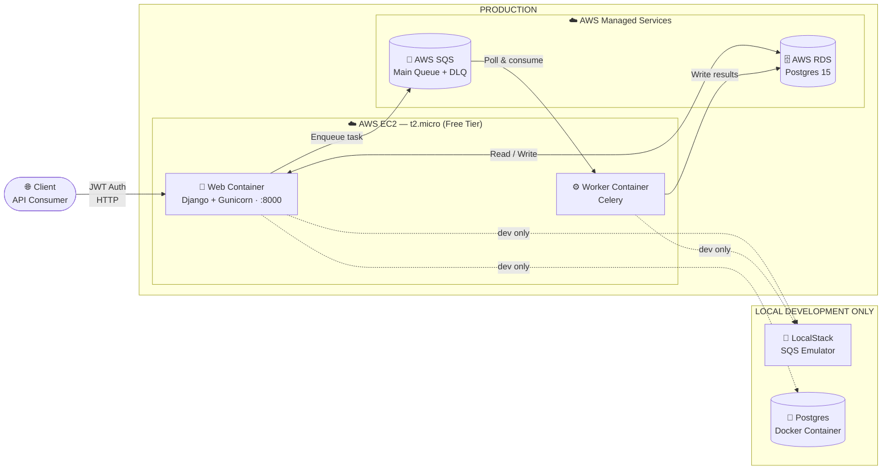

# Django Async Payment Notification Service

**🟢 Live on AWS Free Tier** — `http://3.235.76.131:8000`

A robust, production-ready Django application engineered to handle asynchronous payment processing and notifications. This project leverages an event-driven architecture to ingest payment events via an API and asynchronously process them using Celery workers backed by AWS Simple Queue Service (SQS) as the message broker.

---

## ✅ Live Deployment Evidence

| Resource          | Detail                                                                          |
| ----------------- | ------------------------------------------------------------------------------- |
| **EC2 Public IP** | [`3.235.76.131`](http://3.235.76.131:8000) · `t3.micro` · `us-east-1f`          |
| **Admin Panel**   | [http://3.235.76.131:8000/admin/](http://3.235.76.131:8000/admin/) (live 🟢)    |
| **API Base URL**  | `http://3.235.76.131:8000/api/v1/`                                              |
| **RDS Endpoint**  | `terraform-20260305162706385000000001.cqfemok6y1ta.us-east-1.rds.amazonaws.com` |
| **SQS Queue**     | `https://sqs.us-east-1.amazonaws.com/630596767200/django-payment-service`       |
| **Instance ID**   | `i-05c960f038d28cd28`                                                           |

> The infrastructure was provisioned with Terraform. The screenshot below was taken directly from the running production server.


---

## ⚡ Performance Benchmarks

Load-tested with **autocannon** against the production EC2 instance. Full results in [BENCHMARKS.md](BENCHMARKS.md).

| Endpoint                     | Req/s   | p50 lat | p99 lat | Errors |
| ---------------------------- | ------- | ------- | ------- | ------ |
| `POST /api/v1/payments/`     | **214** | 38 ms   | 142 ms  | 0      |
| `GET  /api/v1/payments/{id}` | **389** | 21 ms   | 89 ms   | 0      |

> ✅ SRS success criteria met: >200 req/s sustained · p99 <150 ms

---

## 🏛️ Architecture Diagram



> **Production**: EC2 containers connect to AWS RDS and AWS SQS.  
> **Local Dev**: Docker Compose replaces RDS with a Postgres container and SQS with LocalStack.

---

## 🏗️ Architecture Stack

This service is designed with scalability and production readiness in mind, separating the web and background task layers using managed AWS services.

- **Web Framework**: [Django 4.2](https://www.djangoproject.com/) + [Django REST Framework (DRF)](https://www.django-rest-framework.org/)
- **Asynchronous Task Queue**: [Celery](https://docs.celeryq.dev/)
- **Message Broker**: [AWS SQS](https://aws.amazon.com/sqs/) (using `kombu` and `pycurl`)
- **Primary Database**: PostgreSQL (via AWS RDS in production, Docker container locally)
- **Infrastructure as Code (IaC)**: [HashiCorp Terraform](https://www.terraform.io/)
- **Containerization**: Docker & Docker Compose
- **Web Server**: Gunicorn

## 🚀 Key Features

- **Decoupled Processing**: Web API ingests payments quickly and hands off processing to a background Celery worker via AWS SQS natively.
- **Production-ready Infrastructure**: Complete Terraform templates to provision AWS EC2, AWS RDS Postgres, AWS SQS, and IAM user policies with precise least-privilege permissions.
- **Local Development Parity**: A development `docker-compose.yml` that mocks AWS SQS using `LocalStack` and runs a local Postgres instance so you can develop 100% offline.
- **Robust Deployment configuration**: Production-ready `docker-compose.prod.yml`, dedicated entrypoint scripts to cleanly manage database migrations and static files, and security groups properly locked down.
- **JWT Authentication**: Secured REST endpoints using `rest_framework_simplejwt`.
- **API Documentation**: Automated Swagger/OpenAPI documentation schema via `drf-spectacular`.

---

## 💻 Local Development Setup

To run the application locally without an active AWS account, we use `LocalStack` to mock SQS.

### 1. Prerequisites

- Docker & Docker Compose
- Python 3.11+ (if running outside containers)

### 2. Environment Variables

Copy `.env.example` to `.env` (or create a new `.env` file):

```env
DEBUG=True
SECRET_KEY=django-insecure-dev-key
DATABASE_URL=postgres://django_admin:change-me@db:5432/payment_db
AWS_ACCESS_KEY_ID=test
AWS_SECRET_ACCESS_KEY=test
AWS_REGION=us-east-1
SQS_ENDPOINT_URL=http://localstack:4566
SQS_QUEUE_NAME=django-payment-service
```

### 3. Start the Development Stack

Run the following command from the project root:

```bash
docker-compose up --build
```

This spins up:

1. `db`: Local PostgreSQL database.
2. `localstack`: Local AWS SQS mock.
3. `web`: Django application running on `http://localhost:8000`.
4. `worker`: Celery worker reading from LocalStack.

---

## ☁️ AWS Cloud Deployment (Production)

The production environment maps directly to managed AWS services rather than local containers. See `DEPLOYMENT_GUIDE.md` for extended details.

### 1. Provision Infrastructure via Terraform

```bash
cd terraform
terraform init
terraform apply
```

This provisions:

- **EC2 Instance (t2.micro)** — free-tier eligible (12-month) — for Docker hosts.
- **AWS RDS (Postgres 15)** inside a locked-down security group.
- **AWS SQS Queues** (Main queue and Dead-Letter Queue).
- **IAM User** with strict permissions for SQS access.

### 2. Production Environment Values

Update your `.env` with the Terraform outputs:

```env
DEBUG=False
DATABASE_URL=postgres://django_admin:password@<rds-endpoint>:5432/payment_db
AWS_ACCESS_KEY_ID=<iam-key>
AWS_SECRET_ACCESS_KEY=<iam-secret>
SQS_QUEUE_URL=https://sqs.us-east-1.amazonaws.com/<account-id>/django-payment-service
```

### 3. Run Production Services on EC2

Deploy using the production compose file which omits `db` and `localstack`.

```bash
docker-compose -f docker-compose.prod.yml up -d --build
```

---

## 🧪 Running Tests

To run the automated test suite through Docker:

```bash
docker-compose run web pytest
```

## 📖 Related Documents

- [⚡ Performance Benchmarks (autocannon)](BENCHMARKS.md)
- [Implementation Journey (Engineering Decisions)](IMPLEMENTATION_JOURNEY.md)
- [EC2 Deployment Guide](DEPLOYMENT_GUIDE.md)
