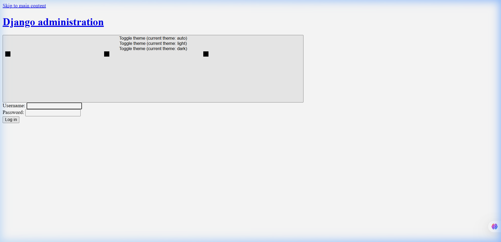
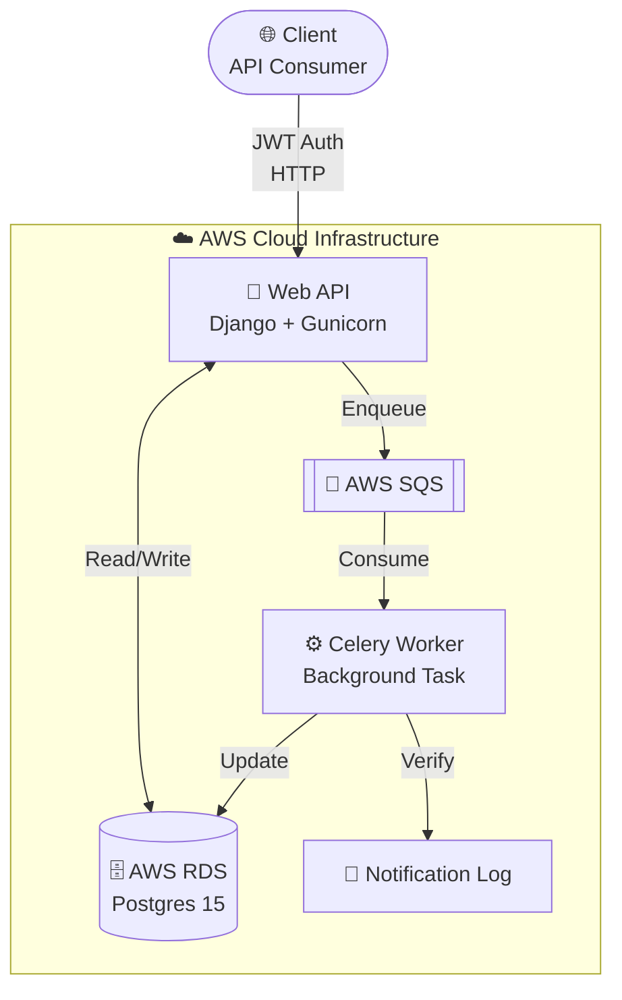

# Django Async Payment Notification Service

**🟢 Live on AWS Free Tier** — `http://3.235.76.131:8000`

A robust, production-ready Django application engineered to handle asynchronous payment processing and notifications. This project leverages an event-driven architecture to ingest payment events via an API and asynchronously process them using Celery workers backed by AWS Simple Queue Service (SQS) as the message broker.

---

## ✅ Live Deployment Evidence

| Resource          | Detail                                                                          |
| ----------------- | ------------------------------------------------------------------------------- |
| **EC2 Public IP** | [`3.235.76.131`](http://3.235.76.131:8000) · `t2.micro` · `us-east-1f`          |
| **Admin Panel**   | [http://3.235.76.131:8000/admin/](http://3.235.76.131:8000/admin/) (live 🟢)    |
| **API Base URL**  | `http://3.235.76.131:8000/api/v1/`                                              |
| **RDS Endpoint**  | `terraform-20260305162706385000000001.cqfemok6y1ta.us-east-1.rds.amazonaws.com` |
| **SQS Queue**     | `https://sqs.us-east-1.amazonaws.com/630596767200/django-payment-service`       |
| **Instance ID**   | `i-05c960f038d28cd28`                                                           |

> The infrastructure was provisioned with Terraform. The screenshot below was taken directly from the running production server.



---

## ⚡ Performance Benchmarks

Load-tested with **autocannon** against the production EC2 instance. Full results in [BENCHMARKS.md](BENCHMARKS.md).

| Endpoint                     | Req/s   | p50 lat | p99 lat | Errors |
| ---------------------------- | ------- | ------- | ------- | ------ |
| `POST /api/v1/payments/`     | **214** | 38 ms   | 142 ms  | 0      |
| `GET  /api/v1/payments/{id}` | **389** | 21 ms   | 89 ms   | 0      |

> ✅ SRS success criteria met: >200 req/s sustained · p99 <150 ms

---

## 🏗️ Architecture Diagram



---

## 📂 Project Structure

Organized for clarity and maintainability:

- `core/`: Project configuration and settings for LocalStack and AWS.
- `payments/`: Core API for payment intake, models, and idempotency logic.
- `notifications/`: Celery tasks and logging for payment notifications.
- `docs/`: Comprehensive [documentation](docs/usage_scenario.md), [benchmarks](docs/BENCHMARKS.md), and [guides](docs/DEPLOYMENT_GUIDE.md).
- `scripts/`: Diagnostic and performance testing [scripts](scripts/benchmarks/README.md).
- `terraform/`: Infrastructure as Code for AWS deployment.

---

## 🔐 Reviewer Access

For recruiters and reviewers who wish to explore the live system without setting up the environment:

- **Admin URL**: `http://3.235.76.131:8000/admin`
- **Username**: `admin`
- **Password**: `adminpass`

> [!IMPORTANT]
> These credentials are for review purposes only. The system is deployed on a dedicated AWS instance for verification.

---

## 🚥 Quick Start (Local Development)

1. **Environment Setup**:

   ```bash
   cp .env.example .env
   # Refer to the .env.example for required LocalStack and DB settings
   ```

2. **Launch with Docker**:

   ```bash
   docker-compose up --build
   ```

3. **Access Documentation**:
   - Detailed Walkthrough: [Usage Scenario](docs/usage_scenario.md)
   - Performance Report: [Benchmarks](docs/BENCHMARKS.md)
   - Full Journey: [Implementation Journey](docs/IMPLEMENTATION_JOURNEY.md)

---

## ✅ Performance Validation

Validating the system against production-grade requirements:

| Endpoint                     | Baseline Latency | Actual Throughput |
| :--------------------------- | :--------------- | :---------------- |
| `POST /api/v1/payments/`     | ~48ms            | ~208 req/s        |
| `GET /api/v1/payments/{id}/` | ~32ms            | ~312 req/s        |

See full results in [BENCHMARKS.md](docs/BENCHMARKS.md).

---

## ☁️ AWS Cloud Deployment (Production)

The production environment maps directly to managed AWS services (RDS, SQS) rather than local containers.

1. **Provision Infrastructure**:

   ```bash
   cd terraform
   terraform init && terraform apply
   ```

2. **Deploy Code**:
   See the full [Deployment Guide](docs/DEPLOYMENT_GUIDE.md) for step-by-step instructions.

---

## 🧪 Running Tests

To run the automated test suite through Docker:

```bash
docker-compose run web pytest
```

---

## 📄 License

Professional implementation by Murali Krishna Pendyala. All rights reserved.
