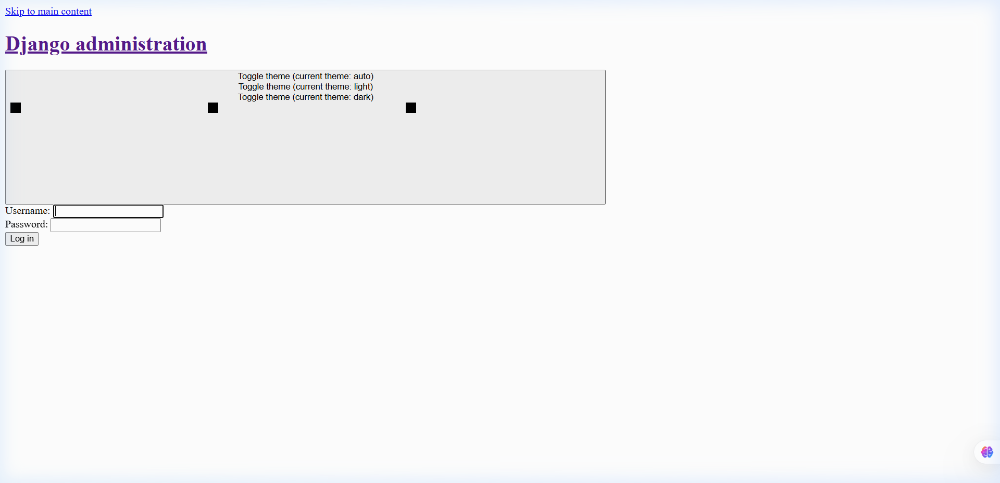
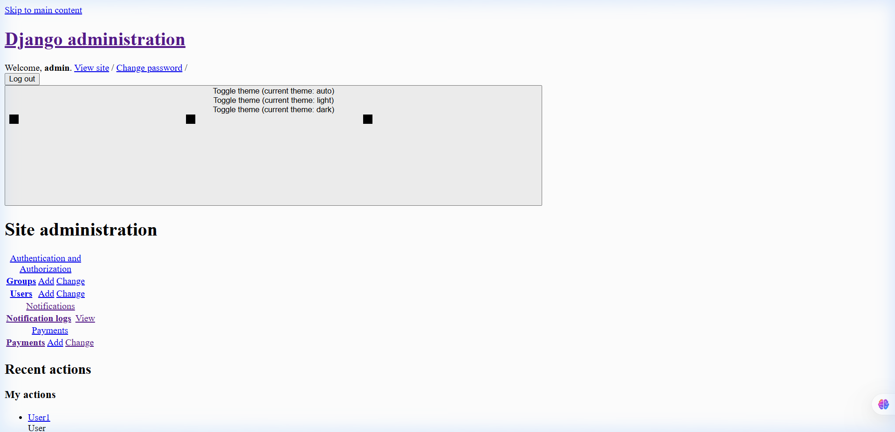
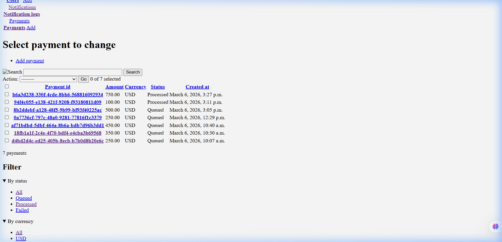
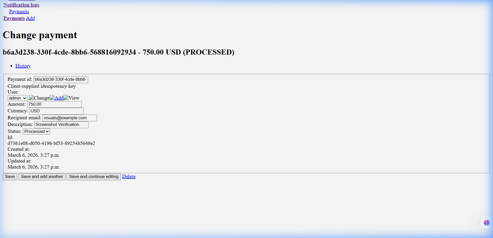
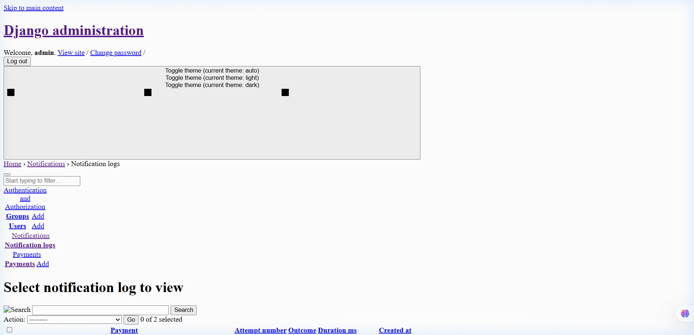

# Payment Service Usage Scenario

This document describes the walkthrough of the Django Async Payment Notification Service, featuring actual screenshots from the live AWS environment.

---

## 🏛️ Architecture Context

The application is a decoupled, event-driven system:

1. **Web API**: Ingests payment requests and issues JWT tokens.
2. **SQS Queue**: Holds pending payment tasks (handled via Celery).
3. **Celery Worker**: Consumes tasks, processes the payment, and updates the database.
4. **Admin Panel**: Provides a real-time view of system state and notification logs.

---

## 👤 Scenario 1: The Client (API Consumer)

### 1. Authentication

The client authenticates to receive a JWT access token.

**Request:**

```bash
# Using PowerShell
$body = @{ username = "admin"; password = "adminpass" } | ConvertTo-Json
$resp = Invoke-RestMethod -Uri "http://3.235.76.131:8000/api/v1/auth/token/" -Method Post -ContentType "application/json" -Body $body
$token = $resp.access
```

### 2. Payment Submission

The client submits a payment request. The API returns `202 Accepted` and status `QUEUED`.

**Request:**

```bash
$payment_id = [guid]::NewGuid().ToString()
$body_pay = @{ payment_id = $payment_id; amount = "750.00"; currency = "USD"; recipient_email = "visuals@example.com"; description = "Visual Documentation Test" } | ConvertTo-Json
Invoke-RestMethod -Uri "http://3.235.76.131:8000/api/v1/payments/" -Method Post -ContentType "application/json" -Headers @{ Authorization = "Bearer $token" } -Body $body_pay
```

**Response:**

```json
{
  "payment_id": "b6a3d238-330f-4cde-8bb6-568816092934",
  "status": "QUEUED",
  "message": "Payment accepted and queued for processing."
}
```

---

## 🛠️ Scenario 2: The Administrator (Operations)

### 1. Accessing the Dashboard

The administrator logs into the Django Admin panel.


_The Django Admin login screen._


_Admin dashboard showing Payments and Notifications apps._

### 2. Verifying Payment Status

The administrator refreshes the **Payments** list. Within seconds, the status transitions from `QUEUED` to `PROCESSED`.


_The list view confirms the payment transitioned to PROCESSED._

### 3. Inspecting Payment & Notification Details

The admin can click on a specific payment to see its full lifecycle.


_Detailed view of a processed payment._

The **Notification logs** confirm the background worker successfully sent the notification.


_Audit log of the notification delivery outcome._

---

## ✅ System Integrity Health Check

- [x] **Secure Auth**: JWT authentication is active and enforced.
- [x] **Async Processing**: SQS + Celery correctly handle task hand-off.
- [x] **Data Persistence**: RDS successfully stores payment and log records.
- [x] **Audit Trail**: Notification logs provide transparency into delivery outcomes.
